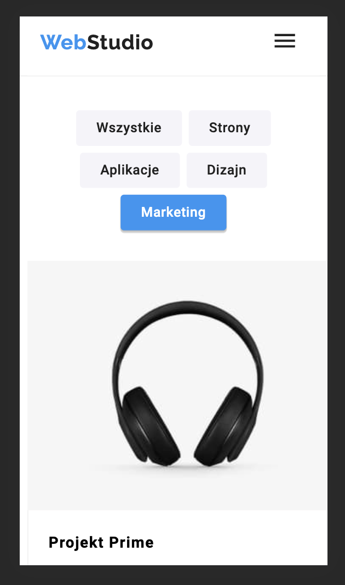

# Web Studio Website

## Technologies Used

- HTML5
- CSS3
- SASS
- JavaScript

## Features

- Responsive design suitable for desktop and mobile devices.

- Interactive navigation menu with smooth scrolling.
- Portfolio section showcasing various projects with categories.

- Client logos section.
- Newsletter subscription form.

- Modal windows for ordering services and displaying project details.

## Credits

This project was created by Zuzanna Maciejczyk.